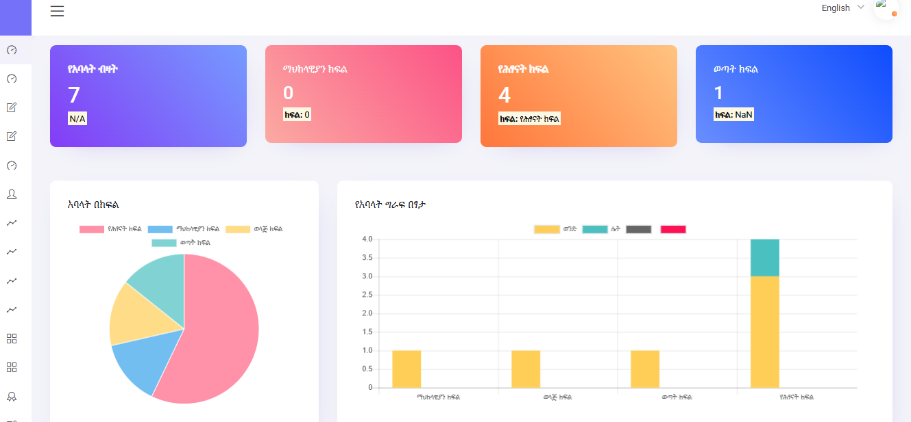
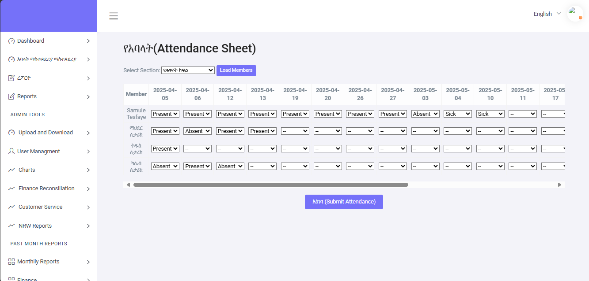
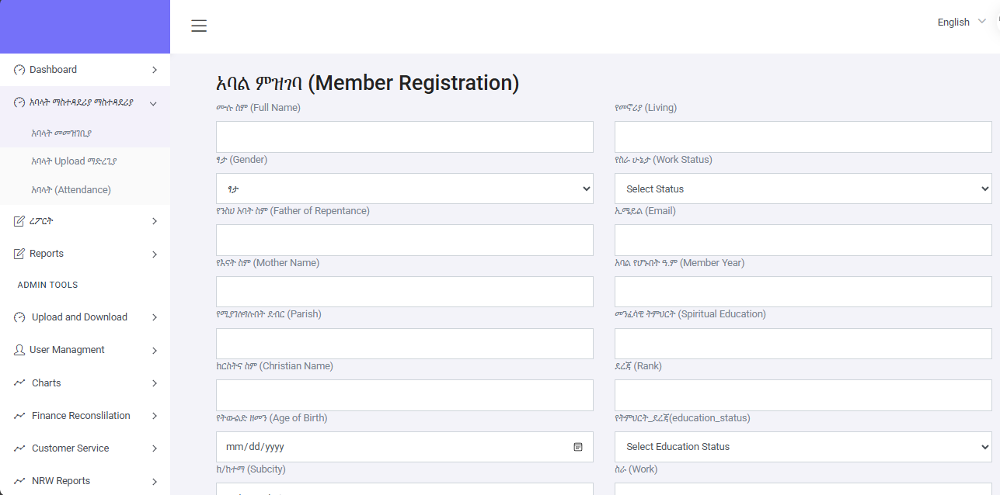
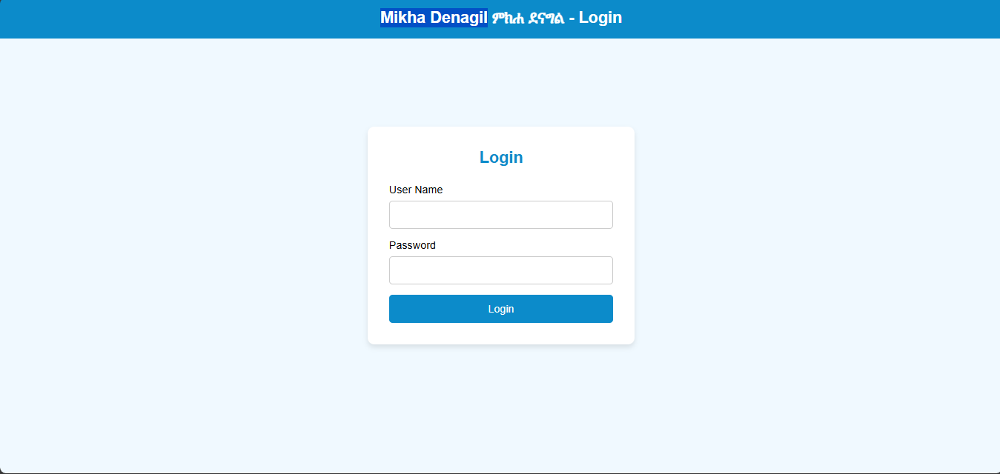

# Mikha Denagil Spiritual Society Management System

A comprehensive management system built for the **Mikha Denagil Spiritual Society** to handle member registration, attendance tracking, library management, contribution (MEWACO) management, section & medebe management, and comprehensive reporting.

---

## ✅ Current Features Implemented

### 👥 **Member Management**
- 🔁 **Mass Member Upload** via Excel or CSV
- 📁 **Member Registration**: Add, update, delete member records with modern UI
- 🔍 **Advanced Search & Filter** by name, section, gender
- 📊 **Member Statistics Dashboard**: Real-time member counts by section, gender, marital status, employment
- 📋 **Comprehensive Member Reports** with charts and analytics
  - Section-wise distribution
  - Age and education demographics
  - Gender and subcity analysis
  - Export to PDF, Excel, CSV

### 📅 **Attendance Management**
- ✅ **Modern Attendance Tracking System** with intuitive interface
- 📈 **Attendance Reports** with enhanced UI/UX
  - Exportable reports categorized by section or medebe
  - Visual charts and statistics
  - Filter by date range, section, and status
- 📊 **Dashboard with Attendance Charts** and analytics

### 📚 **Library Management System**
- 📖 **Book Registration & Inventory Management**
  - Add, edit, delete books with full details
  - Track book categories, authors, publishers
  - ISBN tracking and language support
  - Availability monitoring (total vs available copies)
- 📑 **Book Borrowing & Return Management (መዋስ)**
  - Borrow and return tracking
  - Member-based borrowing history
  - Overdue book monitoring
  - Return date management
- 📊 **Library Reports**
  - Book inventory reports with availability status
  - Borrowing transaction reports
  - Filter by category, author, status
  - Export to PDF, Excel, CSV

### 💰 **MEWACO (Contribution) Management**
- 🏷️ **Contribution Type Management**
  - Create and manage different contribution types
  - Set default amounts per type
  - Active/Inactive status control
- 💵 **Monthly Contribution Collection**
  - Bulk monthly contribution recording
  - Individual member contribution tracking
  - Excel/CSV bulk upload support
  - Payment status tracking (Paid/Unpaid/Partial)
- 📈 **Contribution Reports**
  - Monthly contribution reports with charts
  - Member contribution summary and history
  - Expected vs collected analysis
  - Outstanding balance tracking
  - Export to PDF, Excel, CSV

### 🏢 **Section & Medebe Management**
- 📋 **Medebe (Sub-Section) Management**
  - Create, edit, delete medebe (ምድብ)
  - Assign medebe to main sections (የሕፃናት / ወጣት / ማህከላዊያን / ወላጅ)
  - Track member counts per medebe
  - Search and filter functionality
- 👤 **Member Assignment Management**
  - Manual member-to-medebe assignment
  - Auto-assignment with even distribution
  - Cross-section validation
  - Assignment status indicators
- 📊 **Medebe Reports**
  - Section statistics and distribution charts
  - Member-to-medebe assignment reports
  - Filter by section and medebe
  - Export to PDF, Excel, CSV

### 🔒 **Security & User Management**
- 🔐 **User Authentication** with JWT/session-based login
- 👤 **User Management System**
- 🎭 **Role-Based Access Control (RBAC)**
  - Manage roles and permissions
  - Route-level access control
  - Role-based menu visibility

### 📊 **Dashboard & Reporting**
- 📈 **Interactive Dashboard** with real-time statistics
  - Member statistics by section and gender
  - Attendance overview
  - Visual charts (pie, bar, doughnut)
  - Export full dashboard to PDF
- 📑 **Comprehensive Reporting System**
  - Member reports
  - Attendance reports
  - Library reports
  - Contribution reports
  - Medebe reports
  - Multiple export formats (PDF, Excel, CSV)

---

## 🔮 Upcoming Features

- 📆 **Holiday Selector and Calendar Integration**
- 📱 **Mobile App for Attendance (Android/iOS)**
- 📧 **Email/SMS Notifications**
- 💳 **Payment Gateway Integration**
- 📊 **Advanced Analytics & Data Visualization**
- 🔔 **Automated Reminders for Contributions**

---

## 🖥️ Screenshots

> 📌 Add actual screenshots in `/screenshots/` and replace the image links below

| Dashboard | Attendance | Member Registration |
|-----------|------------|---------------------|
|  |  |  |

| Library Management | MEWACO | Medebe Management |
|-------------------|--------|-------------------|
|  | Coming Soon | Coming Soon |

---

## 🛠️ Technologies Used

### Frontend
- **HTML5, CSS3, JavaScript**
- **Bootstrap 4** - Responsive UI framework
- **Chart.js** - Data visualization
- **jQuery** - DOM manipulation
- **DataTables** - Advanced table functionality
- **Select2** - Enhanced select boxes

### Backend
- **Python 3.8+**
- **Flask Framework** - Web application framework
- **MySQL** - Database management
- **mysql-connector-python** - Database connectivity
- **pandas** - Data processing for Excel/CSV uploads
- **Werkzeug** - Security utilities

### Reporting & Export
- **jsPDF** - PDF generation
- **html2canvas** - Screenshot capture
- **openpyxl** - Excel file handling
- **CSV export** - Built-in Python support

### Authentication & Security
- **JWT** - Token-based authentication
- **Flask-Session** - Session management
- **Password hashing** - Secure credential storage
- **RBAC** - Role-based access control

---

## 🚀 Installation Guide

### Prerequisites

- Python 3.8+
- MySQL Server 5.7+ or 8.0+
- Git
- virtualenv or venv (recommended)

### Step-by-Step Setup

#### 1. **Clone the Repository**
```bash
git clone https://github.com/your-username/Mikha_Denagil.git
cd Mikha_Denagil
```

#### 2. **Set Up Virtual Environment**

It's recommended to isolate your project dependencies using a virtual environment:

##### On Windows:
```bash
python -m venv venv
venv\Scripts\activate
```

##### On Linux/Mac:
```bash
python3 -m venv venv
source venv/bin/activate
```

#### 3. **Install Dependencies**
```bash
pip install -r requirements.txt
```

Required packages include:
- Flask
- mysql-connector-python
- pandas
- openpyxl
- werkzeug
- python-dotenv

#### 4. **Configure Database**

Create a MySQL database:
```sql
CREATE DATABASE mikha_denagil;
```

Update database configuration in `database.py`:
```python
MYSQL_CONFIG = {
    'host': 'localhost',
    'user': 'your_username',
    'password': 'your_password',
    'database': 'mikha_denagil',
    'charset': 'utf8mb4'
}
```

#### 5. **Initialize Database**

The system will automatically create all necessary tables on first run:
- member_registration
- attendance
- library_books
- book_borrowing
- mewaco_types
- mewaco_contributions
- medebe
- member_medebe_assignment
- users
- roles
- routes
- role_routes

Sample data will be inserted automatically for testing.

#### 6. **Run the Application**
```bash
python app_modular.py
```

The application will be available at: `http://localhost:5001`

#### 7. **Default Login Credentials**

Check `database.py` for default user credentials or create new users through the user management interface.

---

## 📁 Project Structure

```
Mikha_Denagil/
│
├── app_modular.py           # Main Flask application with all routes
├── database.py              # Database configuration and initialization
├── auth.py                  # Authentication and authorization
├── utils.py                 # Utility functions
│
├── templates/               # HTML templates
│   ├── base.html           # Base template with navigation
│   ├── navigation.html     # Dashboard with statistics
│   ├── manage_members.html # Modern member management
│   ├── member_report.html  # Comprehensive member reports
│   ├── attendance_section.html      # Modern attendance tracking
│   ├── attendance_report.html       # Enhanced attendance reports
│   ├── library_books.html           # Book registration
│   ├── borrow_management.html       # Book borrowing system
│   ├── book_report.html             # Library reports
│   ├── mewaco_types.html            # Contribution types
│   ├── monthly_contributions.html   # Monthly contributions
│   ├── contribution_report_monthly.html  # Contribution reports
│   ├── medebe_management.html       # Medebe management
│   ├── member_medebe_assignment.html # Member assignments
│   ├── medebe_report.html           # Medebe reports
│   └── login.html                   # Login page
│
├── static/                  # Static files
│   ├── css/                # Stylesheets
│   ├── js/                 # JavaScript files
│   ├── images/             # Images and icons
│   ├── plugins/            # Third-party plugins
│   └── icons/              # Icon libraries
│
├── requirements.txt        # Python dependencies
└── README.md              # This file
```

---

## 🔧 Configuration

### Database Configuration
Edit `database.py` to configure your MySQL connection:
```python
MYSQL_CONFIG = {
    'host': 'localhost',
    'user': 'root',
    'password': 'your_password',
    'database': 'mikha_denagil'
}
```

### Application Settings
Configure Flask settings in `app_modular.py`:
```python
app.config['SECRET_KEY'] = 'your-secret-key'
app.config['UPLOAD_FOLDER'] = 'uploads/'
app.config['MAX_CONTENT_LENGTH'] = 16 * 1024 * 1024  # 16MB max file size
```

---

## 📚 Module Documentation

### Library Management System
See `LIBRARY_SYSTEM_COMPLETE.md` for detailed documentation on:
- Book registration and management
- Borrowing system workflow
- Report generation
- Database schema

### MEWACO Contribution System
See `MEWACO_SYSTEM_COMPLETE.md` and `MEWACO_EXTENDED_FEATURES.md` for:
- Contribution type management
- Monthly collection process
- Bulk upload functionality
- Reporting capabilities

### Section & Medebe Management
See `MEDEBE_SYSTEM_COMPLETE.md` for:
- Medebe creation and management
- Member assignment workflows
- Auto-assignment algorithms
- Report generation

### UI Modernization
See `UI_MODERNIZATION_COMPLETE.md` for:
- Member management UI enhancements
- Attendance system improvements
- Report interface updates
- Design patterns and best practices

---

## 👥 User Roles & Permissions

The system supports role-based access control with the following default roles:

- **Admin**: Full system access
- **Manager**: Access to all modules except user management
- **Librarian**: Library management access
- **Treasurer**: MEWACO contribution management
- **Section Leader**: Section-specific member and attendance management
- **Viewer**: Read-only access to reports

---

## 📊 Reports Available

### Member Reports
- Member statistics by section, gender, age
- Education and employment demographics
- Subcity distribution
- Comprehensive member lists with filters

### Attendance Reports
- Daily, weekly, monthly attendance summaries
- Section-wise attendance analysis
- Individual member attendance history
- Present/Absent/Excuse statistics

### Library Reports
- Book inventory with availability
- Borrowing transaction history
- Overdue books report
- Member borrowing history

### Contribution Reports
- Monthly contribution summaries
- Member payment history
- Expected vs collected analysis
- Outstanding balance reports

### Medebe Reports
- Section distribution statistics
- Member-to-medebe assignments
- Medebe member counts
- Cross-section analysis

---

## 🛡️ Security Features

- **Password Hashing**: Secure password storage using Werkzeug
- **Session Management**: Secure session handling with Flask-Session
- **JWT Authentication**: Token-based API authentication
- **RBAC**: Role-based route protection
- **SQL Injection Protection**: Parameterized queries
- **XSS Protection**: Template escaping and sanitization
- **CSRF Protection**: Form token validation

---

## 🤝 Contributing

Contributions are welcome! Please follow these steps:

1. Fork the repository
2. Create a feature branch (`git checkout -b feature/AmazingFeature`)
3. Commit your changes (`git commit -m 'Add some AmazingFeature'`)
4. Push to the branch (`git push origin feature/AmazingFeature`)
5. Open a Pull Request

---

## 📝 License

This project is proprietary software developed for the Mikha Denagil Spiritual Society.

---

## 📞 Support & Contact

For support, questions, or feature requests:
- **Email**: support@mikhadenagil.org
- **Phone**: +251-xxx-xxx-xxx
- **Address**: Addis Ababa, Ethiopia

---

## 🙏 Acknowledgments

- Mikha Denagil Spiritual Society leadership and members
- Flask and Python community
- Bootstrap and Chart.js contributors
- All open-source library contributors

---

## 📈 Version History

### Version 2.0.0 (Current)
- ✅ Complete UI/UX modernization
- ✅ Library Management System
- ✅ MEWACO Contribution Management
- ✅ Section & Medebe Management
- ✅ Comprehensive reporting system
- ✅ Enhanced member management
- ✅ Modern attendance tracking

### Version 1.0.0
- Initial release with basic member and attendance management

---

**Built with ❤️ for the Mikha Denagil Spiritual Society Community**
